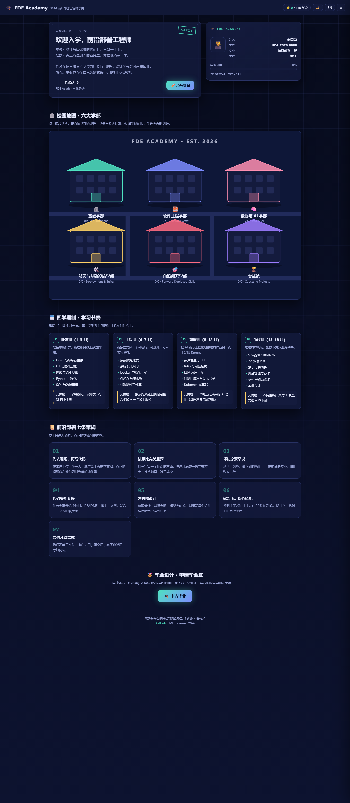

# 🎓 FDE Academy · 2026 前沿部署工程师学习路线图

<div align="center">

**把 Forward Deployed Engineer 的成长路径做成一所学校：**
**录取通知书 · 学生证 · 校园地图 · 六大学部 · 学分系统 · 毕业证书**

[](LICENSE)
[](https://github.com/zhenmaoge520/fde-academy/stargazers)


**在线体验：https://zhenmaoge520.github.io/fde-academy/**



</div>

---

## 🏫 为什么做成一所学校？

市面上的 Roadmap 都是一棵静态的树，看三分钟就划走了。**FDE Academy 把学习路线变成一场可以「玩通关」的入学体验**：

- 📜 **录取通知书**开场——先告诉你是来学什么的、要修多少学分
- 🪪 **学生证**——你的名字、学号、专业、年级，都印在上面（点击头像还能换造型）
- 🗺️ **校园地图**——六大学部是六栋教学楼，窗户会随你的修课进度一盏盏亮起
- ✅ **学分系统**——勾掉学过的课，学分到账、年级晋升（新生 → 见习 → 前线 → 主力 → 资深 → 毕业生）
- 🏅 **毕业证书**——修满核心课（或 85% 学分）即可申请，证书上有你的名字和编号，可打印
- 🌙 **昼夜校园**——一键切换夜间霓虹 / 白天明亮两套配色
- 🌐 **中英双语**——整个课程体系都有英文版
- 💾 **进度自动保存**在浏览器 localStorage，随时回来接着学

## 🗺️ 六大学部 · 31 门课

| 学部 | 内容 | 学分 |
|---|---|---|
| 🏛️ **基础学部** | Linux / Git / 网络 / Python 工程化 / SQL | 16 |
| 🧱 **软件工程学部** | 后端 / 前端与看板 / 系统设计 / 测试 / CI-CD | 17 |
| 🧠 **数据与 AI 学部** | 数据管道 / RAG / LLM 应用 / Agent / 评测与成本 | 18 |
| 🛠️ **部署与基础设施学部** | Docker / K8s / Terraform / 可观测性 / **离线私有化部署** | 17 |
| 🎯 **前沿部署学部** | 需求挖掘 / 72h POC / 演示讲故事 / 期望管理 / 交付交接 / POC 到产品化 | 21 |
| 🏆 **实战馆** | 数据看板 / 离线部署演练 / RAG 上线 / 流程自动化 / 毕业设计 | 26 |

每门课都有：**学分 · 学时 · 难度 · 是否核心课 · 学习目标 · 验收标准 · 推荐资源**。
核心课是毕业必过项——FDE 的核心竞争力（需求挖掘、POC、演示、交付）全部标为核心。

## 🗓️ 四学期制

| 学期 | 阶段 | 交付物 |
|---|---|---|
| S1（1–3 月） | 地基期 | 一个容器化、带测试、有 CI 的小工具 |
| S2（4–7 月） | 工程期 | 一条从提交到上线的流水线 + 线上服务 |
| S3（8–12 月） | 智能期 | 一个可量化效果的 AI 功能（含评测集与成本账） |
| S4（13–18 月） | 前线期 | 一次完整客户交付 + 复盘文档 + 毕业证 |

## 📜 前沿部署七条军规

先去现场再写代码 · 演示比完美重要 · 坏消息要早说 · 代码要能交接 · 为失败设计 · 砍需求是核心技能 · 交付才算完成

## 🚀 快速开始

```bash
git clone https://github.com/zhenmaoge520/fde-academy.git
cd fde-academy
python -m http.server 8080
# 打开 http://localhost:8080
```

或者直接双击 `index.html`。零依赖，没有构建步骤。

**分享链接**：`?lang=en` 英文版 · `?b=fde` 直接打开前沿部署学部 · `?time=day` 白天校园

## ✏️ 改成你自己的路线图

所有课程内容都在 **`js/data.js`**，中英文各一份，字段说明写在文件头部注释里。加课程 = 加一个对象；想改成其他职业的 Roadmap（比如 SRE、数据工程师），改这一个文件就够了。

## 📁 目录结构

```
fde-academy/
├── index.html      # 页面骨架：通知书 / 学生证 / 校园 / 抽屉 / 毕业证
├── css/style.css   # 昼夜两套配色 + 全部布局
├── js/i18n.js      # 界面文案（中/英）
├── js/data.js      # ★ 课程体系：6 学部 31 门课 + 学期 + 军规
├── js/app.js       # 校园地图 SVG 渲染、学分逻辑、毕业证书
└── assets/         # README 截图
```

## 🤝 贡献

欢迎 PR：补充课程资源链接、修正路线建议、新增语言、新的校园彩蛋。
如果你按这份路线图找到了 FDE 的工作，欢迎回来开个 Issue 分享经历。

## ⭐ 支持一下

如果这份路线图帮到了你，点个 Star 就是最好的学费。

<div align="center">

**[🎓 入学](https://zhenmaoge520.github.io/fde-academy/)** · Made with ❤️ and zero dependencies

</div>

---

## English

**FDE Academy** turns the 2026 Forward Deployed Engineer roadmap into a school: admission letter, student ID card, an interactive campus map with six departments (31 courses), a credit system with grade progression, and a printable graduation certificate.

- **Six departments**: Foundations · Software Craft · Data & AI · Deployment & Infra (incl. air-gapped delivery) · Forward Deployed Skills · Capstone Projects
- **Every course** has credits, hours, difficulty, acceptance criteria and resources; core courses are required to graduate
- **Day / night campus**, **bilingual (中/EN)**, progress saved in localStorage
- **Pure static, zero dependencies** — just open `index.html`

**Live demo**: https://zhenmaoge520.github.io/fde-academy/

PRs welcome. If this roadmap helped you land an FDE role, a Star is the best tuition. ⭐

## 📄 License

[MIT](LICENSE) © 2026 [zhenmaoge520](https://github.com/zhenmaoge520)
